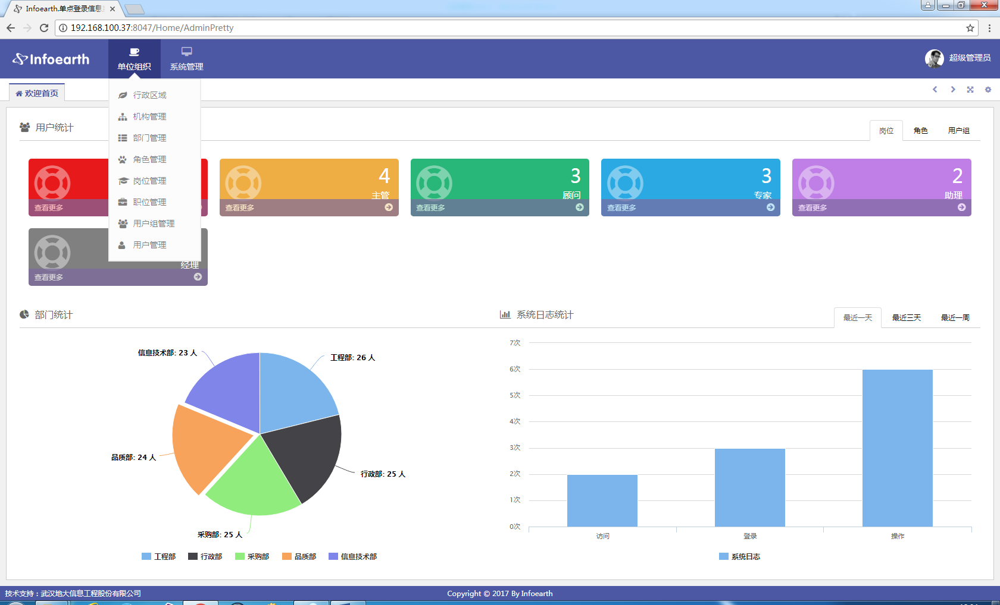
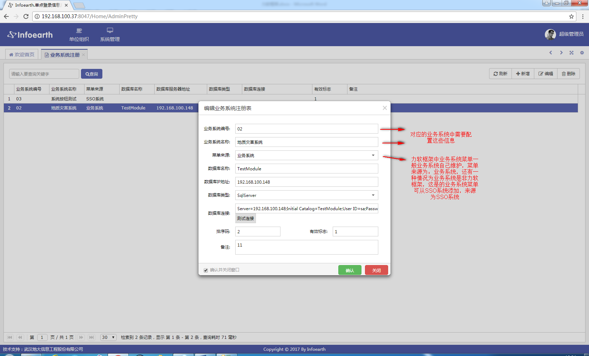
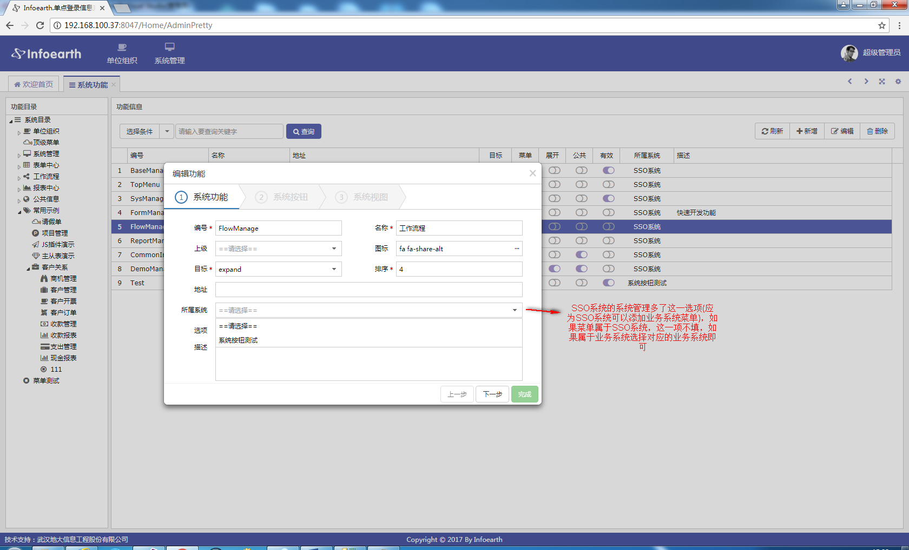
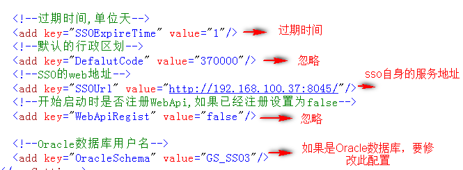

3.SSO
===============================
SSO系统提供：行政区划，机构，部门，角色，岗位，职位，用户组，用户，菜单管理，业务系统注册，系统日志，授权等功能。

=========
3.1 业务系统注册
=========
业务系统注册主要用于注册业务系统，以方便SSO系统获取业务系统的菜单及菜单对应的按钮。如下所示：

=========
3.2 系统功能（菜单管理）
=========

=========
3.3 服务接口
=========
获取行政区划，机构，部门，人员和授权信息的服务详细参照《SSOWebApi服务接口文档说明》

注意：所有的Api接口都要传Token，且Token需要Md5加密。

=========
3.4 系统配置
=========
力软框架的配置文件在XmlConfig文件夹下面。主要关注database.config和system.config配置文件

database.config： 数据库连接字符串配置文件。

system.config：系统参数的配置文件。主要关注下图的几个参数：

=========
3.5 系统部署
=========
详细见SSO部署文档

=========
3.6 数据库表结构说明
=========
SSO数据库结构说明(目前SSO已用到的表.htm)
