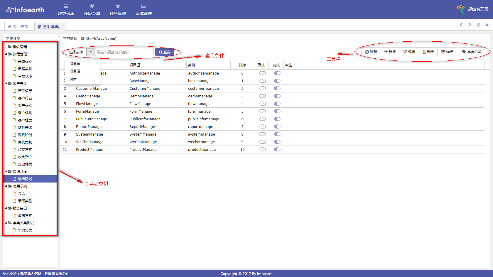
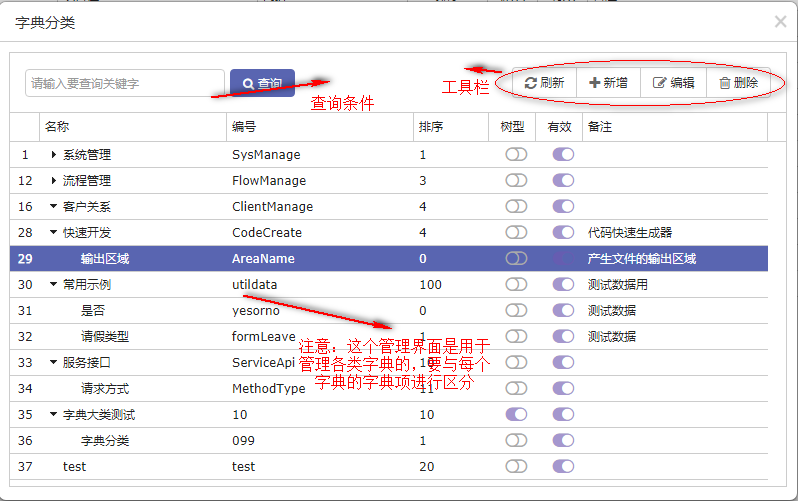
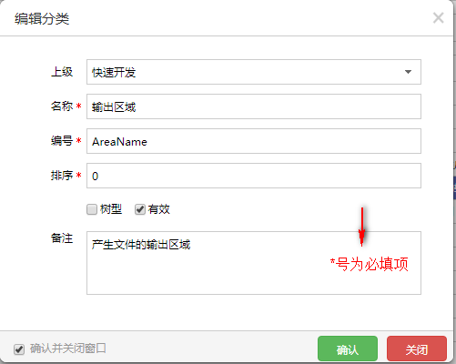
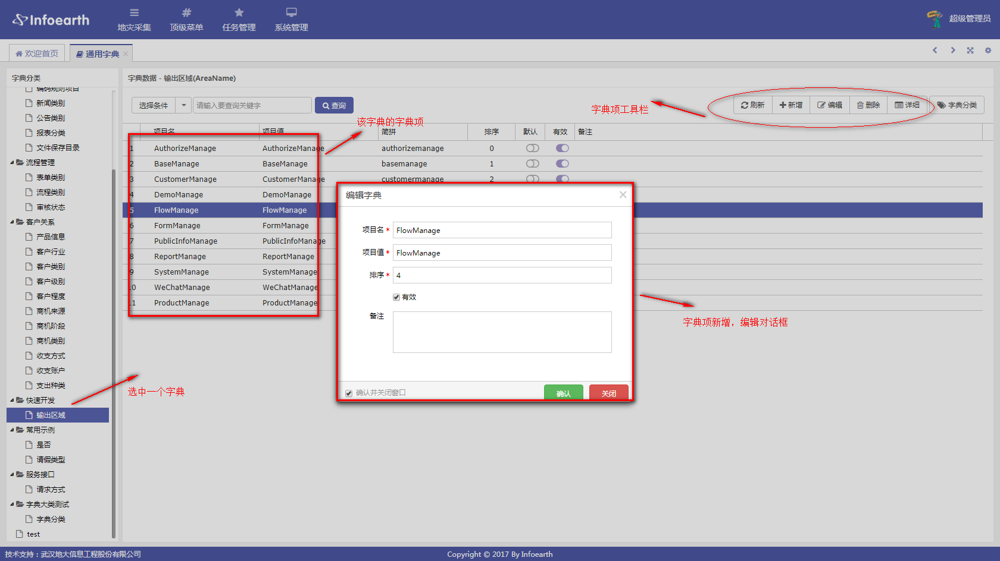
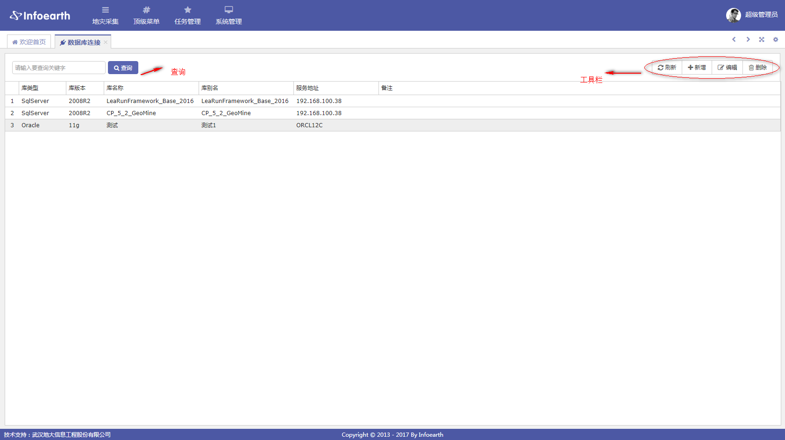
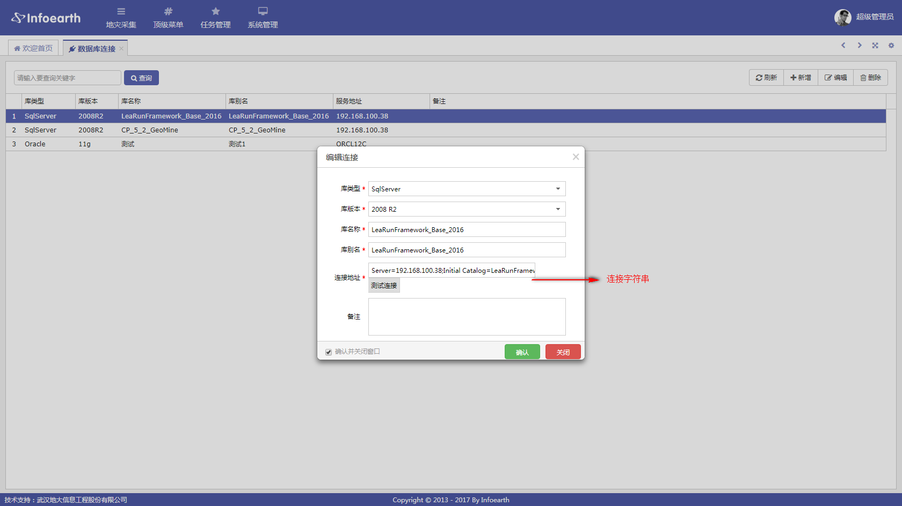
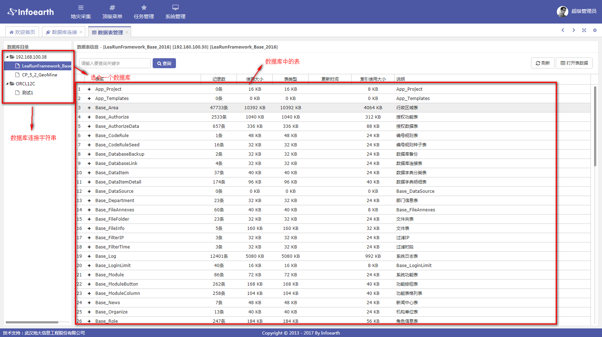
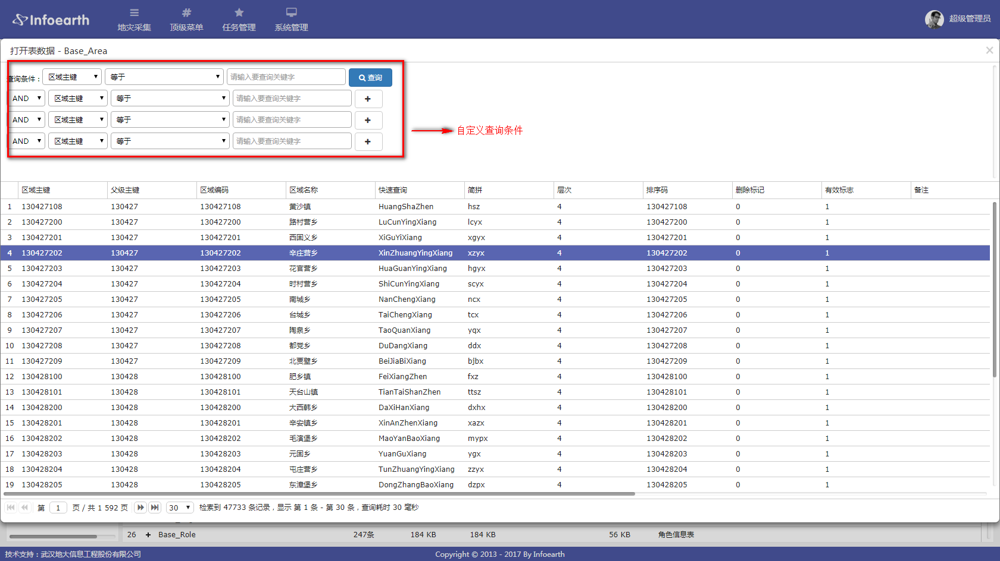

4.业务系统
===========================
业务系统提供：字典管理，菜单管理，敏捷开发，Excel导入导出，服务注册，数据管理，消息通知，任务调度和各种业务组件等功能。

===========
4.1 字典管理
===========
点击系统管理下面的通用字典菜单进入字典管理界面

-----------
4.1.1 字典分类
-----------
字典分类用于管理各类字典，点击字典分类，弹出字典分类对话框

- 字典新增、编辑
点击字典分类中的新增或编辑按钮，弹出对话框

- 字典删除
选中字典分类中的一条记录，点击删除按钮，删除此记录

-----------
4.1.1 字典项管理
-----------
有了字典之后，就要为每个字典添加字典项了

===========
4.2 菜单管理
===========
用于维护业务系统自身的菜单和菜单按钮，操作同SSO的菜单管理

===========
4.3 数据管理
===========
数据管理分为数据库连接和数据表管理

-----------
4.3.1 数据库连接
-----------
数据库连接用于管理数据库连接字符串信息，主要是数据表管理和敏捷开发时使用。

- 新增、编辑
点击新增，编辑按钮，弹出相应对话框。

- 删除
选中一行数据，点击删除按钮，删除此数据

-----------
4.3.2 数据表管理
-----------
数据表管理主要用于自定义查询数据表里的数据。

选中一张表，点击打开表数据按钮，弹出自定义查询页面

===========
4.4 服务注册
===========
服务注册只针对WebApi服务

