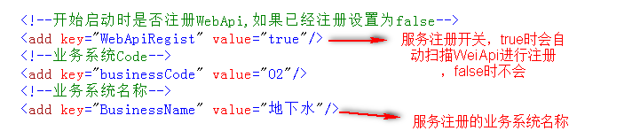
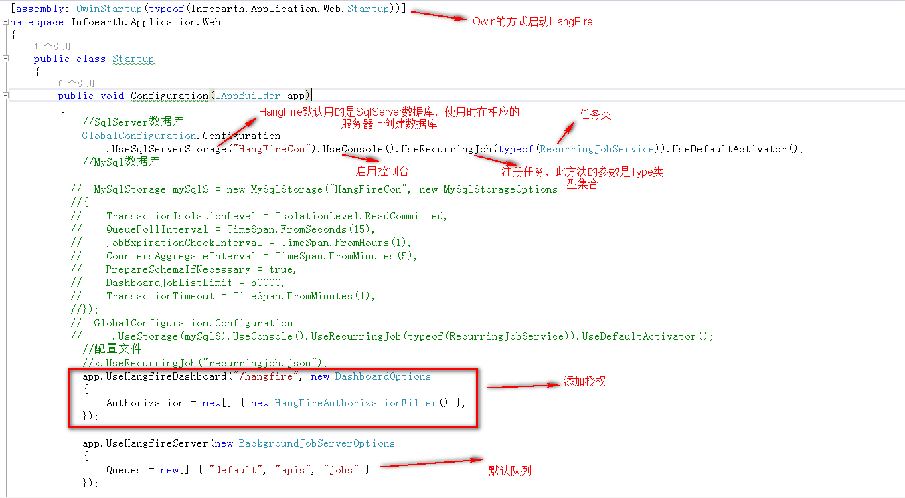

4.业务系统
===========================
业务系统提供：字典管理，菜单管理，敏捷开发，Excel导入导出，服务注册，数据管理，消息通知，任务调度和各种业务组件等功能。

===========
4.1 字典管理
===========
点击系统管理下面的通用字典菜单进入字典管理界面

-----------
4.1.1 字典分类
-----------
字典分类用于管理各类字典，点击字典分类，弹出字典分类对话框

- 字典新增、编辑
点击字典分类中的新增或编辑按钮，弹出对话框

- 字典删除
选中字典分类中的一条记录，点击删除按钮，删除此记录

-----------
4.1.1 字典项管理
-----------
有了字典之后，就要为每个字典添加字典项了

.. image:: image/4-4.png

===========
4.2 菜单管理
===========
用于维护业务系统自身的菜单和菜单按钮，操作同SSO的菜单管理

===========
4.3 数据管理
===========
数据管理分为数据库连接和数据表管理

-----------
4.3.1 数据库连接
-----------
数据库连接用于管理数据库连接字符串信息，主要是数据表管理和敏捷开发时使用。

.. image:: image/4-5.png

- 新增、编辑
点击新增，编辑按钮，弹出相应对话框。

.. image:: image/4-6.png

- 删除
选中一行数据，点击删除按钮，删除此数据

-----------
4.3.2 数据表管理
-----------
数据表管理主要用于自定义查询数据表里的数据。

.. image:: image/4-7.png

选中一张表，点击打开表数据按钮，弹出自定义查询页面

.. image:: image/4-8.png

===========
4.4 服务注册
===========
服务注册只针对WebApi服务

-----------
4.4.1 服务注册配置
-----------

-----------
4.4.2 服务注册
-----------

-----------
4.4.3 服务日志
-----------

- 服务日志启用
业务系统中默认启动服务日志。只需要在WebApiController的类或方法上加上[WebApiTracker]特性，WebApi接口就启用服务日志记录了。

- 服务日志禁用
只需要在WebApiController的类或方法上加上[WebApiNoTracker]特性，WebApi接口就禁用服务日志记录了。

.. image:: image/4-14.png

-----------
4.4.4 服务监控
-----------

===========
4.5 消息通知
===========
消息通知是基于SignalR的实时通知

-----------
4.5.1 消息通知服务端
-----------
消息通知服务端是一个控制台程序，有如下内容：

- 服务端配置

修改上述红色箭头所指的相关配置

-----------
4.5.2 消息通知WebApi接口
-----------
详细查看业务系统中的系统管理----系统组件库----SignalR使用

-----------
4.5.3 消息通知查看
-----------
业务系统提供了每个用户各自消息查看功能,进入业务系统首页上会有消息通知

点击查看更多，查看自己所有消息

===========
4.6 任务调度
===========
框架提供Quartz和HangFire两种任务任务调度功能

-----------
4.6.1 Quartz.net和HangFire比较
-----------
Quartz.net：

- 支持秒级单位的定时任务处理，但是Hangfire只能支持分钟及以上的定时任务处理
-	更加复杂的触发器，日历以及任务调度处理
-	可配置的定时任务

Hangfire：

-	持久化保存任务、队列、统计信息
-	重试机制
-	多语言支持
-	支持任务取消
-	支持按指定Job Queue处理任务
-	服务器端工作线程可控，即job执行并发数控制
-	分布式部署，支持高可用
-	良好的扩展性，如支持IOC、Hangfire Dashboard授权控制、Asp.net Core、持久化存储等

**如果在定时任务处理方面没有很高的要求，比如一定要5s定时执行，Hangfire值得拥有。**

-----------
4.6.2 Quartz.net
-----------

- 自定义任务

- 添加任务
点击任务管理----任务调度QZ菜单，进入QZ任务调度界面

点击任务管理----任务调度QZ菜单，进入QZ任务调度界面

- 启动、停止任务

- Cron表达式

.. image:: image/4-24.png

-----------
4.6.3 HangFire
-----------

- 自定义任务

上述添加任务的方式是代码中硬编码，不便于更改，HangFire还支持Json格式配置，类似于Quartz配置

配置文件

- 任务启动
HangFire是通过Owin的方式进行启动

注意：UseRecurringJob方法也支持Json方式的加载

- 任务查看

- HangFire配置信息

===========
4.7 业务组件
===========

-----------
4.7.1 地图
-----------

**html**

**JS**

**地图控件参数**

**地图控件方法**

  1)	addTagging(type, coordinates, popHtml, vectorArr)添加点线面
    type：类型，固定值：MultiPolygon，Point
    
    coordinates：坐标集合:[[35,35],[35,36]…]
    
    popHtml：点击区域要弹出的内容
    
    vectorArr：拐点区域属性：{ name :” 拐点坐标标注”, color : 'rgba(252, 216, 107, 0.35)' }
    
  2)	appendTagging(type, coordinates, popHtml, vectorArr)追加点线面 
     参数同上
    
  3)	addTaggingArr (type, GDZBArr)添加点线面
    type:同上
    
    GDZBArr：多边形集合:[{ coordinates : [[35,35],[35,36]…]},{}…]
    
  4)	addMarker(markerArr) 添加标注  
    markerArr格式：[{location:[12,13], url:””, popupHtml:””},{}…]
    
    其中：location为经纬度坐标，url为标注图片地址，popupHtml为点击标注要弹出的内容
    
  5)	appendMarker(markerArr) 追加标注
    参数同上
  6)	addLocation(locationArr)定位
    locationArr格式：[{longitude: 117.5,latitude: 34.5},{}…]
  7)	clearMap清理地图
  8)	clearMapDraw清除地图框选
  9)	drawShape (shapeType)自定义绘图
    shapeType：值是固定几个值：circle：画圆，box：矩形，
  10)	setHeight (mapHeight)设置地图高度
  
**地图一些注意点：**
地图控件参数中有getMarkerData和markerDataId两个参数，这两个参数是用于点击地图标注定位业务数据的，markerDataId参数值要在popupHtml内容中有相应的标签Id

引用的js和css

**地图图层配置**
XmlConfig文件夹下的GeoMap.xml文件是地图配置文件

